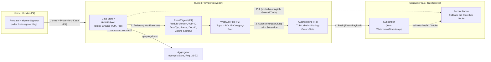

# CSAF 3.0 — Distribution & Discoverability Extensions

*[Read this page in English](README.md)* — dies ist eine wortgetreue, vollständige Übersetzung des
englischen Originaldokuments, kein eigenständiger Text. Im Zweifelsfall ist die englische Fassung
maßgeblich.

## Status dieses Ordners

Dies ist **kein** TC-Arbeitsergebnis, sondern eine individuelle Diskussionsvorlage, vorbereitet im
Hinblick auf die CSAF Community Days (16.–17. November 2026). Ziel ist die frühzeitige, informelle
Vorstellung eines möglichen Erweiterungspakets für eine zukünftige CSAF-Version — im gleichen Geiste
wie der `csaf_2.0`-Sandbox-Ordner, nur eine Version weiter gedacht. Nichts hier ist normativ, nichts
hier bindet die TC.

Die zugrunde liegende Idee entstand aus praktischer Erfahrung: als Betreiber eines CSAF Trusted
Providers (auf Basis der BSI-Referenzimplementierung) und als Partei, die CSAF-Daten mehrerer
Hersteller im Auftrag von Kunden auswerten muss, zeigt sich ein wiederkehrendes strukturelles Problem
im aktuellen Distributionsmodell — siehe Motivation unten.

## Motivation

### Das Problem

CSAF-Dokumente werden heute ausschließlich per **Pull** verteilt (Abschnitt 7.1, Requirements 11–17
der [CSAF-2.1-Spezifikation](../csaf_2.1/prose/share/csaf-v2.1-draft.md)). ROLIE-Feeds erlauben zwar
eine Kategorisierung nach Produkt, liefern aber keine maschinenlesbare Zusammenfassung (betroffene
Produktversion, Vulnerability-ID, Status) auf Feed-Ebene. Wer wissen will, ob ein Dokument ihn
betrifft, muss es öffnen. Bei einem Hersteller mit einem großen, langjährig gewachsenen
Advisory-Bestand bedeutet das: den gesamten Bestand herunterladen, um die eine relevante Handvoll
Dokumente zu finden.

### Realitätscheck an einem konkreten Anbieter

Red Hat veröffentlicht für praktisch jede CVE, die mit seinem Portfolio in Verbindung steht, ein
eigenes CSAF/VEX-Dokument — ein Bestand in der Größenordnung von geschätzt 250.000 Dokumenten. Eine
Stichprobe des öffentlichen Advisory-Verzeichnisses
([`security.access.redhat.com/data/csaf/v2/advisories/2025/`](https://security.access.redhat.com/data/csaf/v2/advisories/2025/),
abgerufen 2026-08-15) zeigt Dateigrößen von ca. 9 KB bis 3,5 MB, typischerweise 25–400 KB.

Bei 250.000 Dokumenten und einer (konservativ angesetzten) Durchschnittsgröße von 50–150 KB ergibt
sich für **einen einzigen Konsumenten, der einmalig den gesamten Bestand spiegeln muss, um die für
ihn relevanten Dokumente zu identifizieren**, ein Transfervolumen von rund **12–36 GB** — für einen
einzigen Hersteller, für ein einziges gesuchtes Produkt.

### Hochrechnung auf das Ökosystem

Die eigentliche Dringlichkeit ergibt sich aus der Skalierung: Mit NIS2 und dem Cyber Resilience Act
wächst der Kreis der Organisationen, die CSAF sowohl produzieren als auch konsumieren müssen,
absehbar stark. Nicht jeder Anbieter hat einen Red-Hat-großen Bestand — als vorsichtige,
illustrative Annahme für einen „typischen" Anbieter setzen wir 200 Dokumente an (Größenordnung eines
mittelständischen PSIRT-Bestands über mehrere Jahre), bei weiterhin 50–150 KB pro Dokument:

| Anzahl Anbieter im Ökosystem | Gesamtbestand (Dokumente) | Transfervolumen bei 50 KB/Dok. | Transfervolumen bei 150 KB/Dok. |
| ---: | ---: | ---: | ---: |
| 5.000 | 1.000.000 | ≈ 48 GB | ≈ 143 GB |
| 50.000 | 10.000.000 | ≈ 477 GB | ≈ 1,4 TB |
| 100.000 | 20.000.000 | ≈ 954 GB | ≈ 2,9 TB |

**Wichtiger Vorbehalt:** Diese Tabelle zeigt das Transfervolumen für **einen** Konsumenten, der
**einmalig** den gesamten Bestand spiegelt. In der Praxis wiederholt sich das bei jedem Poll-Zyklus
(täglich/wöchentlich) und — da es heute keine geteilte, gefilterte Distribution gibt — bei **jedem**
Konsumenten unabhängig voneinander erneut. Die reale Zahl ist also ein Vielfaches der Tabelle, nicht
ihre Obergrenze. Wir präsentieren bewusst die konservative Basiszahl mit offen gelegter Methodik,
statt eine beeindruckendere, aber weniger verteidigbare Gesamtzahl zu behaupten.

### Nachhaltigkeit als zusätzlicher, externer Treiber

Datentransfer hat einen Energiepreis. Veröffentlichte Schätzungen zur Energieintensität von
Internet-Datenübertragung schwanken methodisch erheblich (in der Literatur um mehrere
Größenordnungen), zwei häufig zitierte, aktuellere Anhaltspunkte für Festnetz-Übertragung liegen bei
**0,03–0,14 kWh/GB** (u.a. Aslan et al.; EU-ICT-Impact-Studie 2020). Auf unsere 50.000-Anbieter-Zeile
angewendet (477 GB – 1,4 TB) ergäbe das überschlägig **14–200 kWh** für einen einzigen vollständigen
Sync-Durchlauf eines einzigen Konsumenten — eine Größenordnung, die sich bei wiederholten Zyklen und
vielen Konsumenten schnell zu einer nicht-trivialen Zahl summiert.

> Wir empfehlen, diese Zahl im Vortrag explizit als **Größenordnungsargument, nicht als belastbare
> Kennzahl** zu behandeln und die Methodik-Unsicherheit offen zu benennen. Sie dient dazu, einen
> zusätzlichen, TC-externen Treiber (Nachhaltigkeitsdiskussion, EU-Green-Deal-Bezug) neben dem
> primären Effizienzargument zu platzieren — nicht, um sie als harten Beweis zu verteidigen.

### Warum jetzt

Das Problem existiert seit CSAF 2.0. Es wird erst jetzt dringlich, weil regulatorisch getriebene
Verbreitung (NIS2, CRA) absehbar dazu führt, dass sehr viele Organisationen diesen ineffizienten
Pull-Alles-Mechanismus gleichzeitig und wiederholt ausführen müssen. Das rechtfertigt, das Thema
frühzeitig zu adressieren, statt erst zu reagieren, wenn es zum Skalierungsproblem geworden ist.

## Architektur-Skizze

Kernaussage der Skizze: **Nichts Bestehendes wird ersetzt.** Der Data Store / ROLIE-Feed bleibt die
verbindliche, statisch spiegelbare Wahrheitsquelle (das ist die Antwort auf die
Resilienz-/Statefulness-Frage, siehe Gegenargumente unten). Hub, Autorisierung und Event-Schema sind
additive Bausteine obendrauf; ein Provider, der sie nicht implementiert, verliert nichts von dem, was
heute funktioniert.

## Die vier Proposals

Jeder Proposal ist eigenständig bewertbar und umsetzbar; sie bauen aufeinander auf, sind aber nicht
alle zwingend Voraussetzung füreinander (siehe Abhängigkeiten je Proposal). Details in den
Einzeldokumenten unter [`proposals/`](proposals/).

### [P1 — Event-/Digest-Schema](proposals/01-event-schema.de.md)

Kompaktes, maschinenlesbares Zusammenfassungs-Objekt pro Dokumentänderung: Produkt-Version,
Vulnerability-ID (CVE/GHSA/gCVE/…), Dokumenttyp, Status, Dokument-ID, Datum, Signatur.

- **Vorteile:** Transport-unabhängig — funktioniert für Pull *und* Push gleichermaßen; geringe
  Implementierungskosten; löst das Kernproblem ("muss ich das Dokument öffnen, um Relevanz zu
  prüfen") unmittelbar; ließe sich sogar unabhängig von P2–P4 bereits in bestehende ROLIE-Einträge
  oder `changes.csv` integrieren.
- **Nachteile:** Führt eine zweite, separat gepflegte "Zusammenfassung der Wahrheit" neben dem
  eigentlichen Dokument ein — Drift-Risiko, falls Event und Dokument auseinanderlaufen; braucht klare
  Vorrangregeln (Dokument bleibt immer maßgeblich); jede Dokumentänderung erzeugt Pflege-Mehraufwand
  beim Provider.
- **Fazit:** Geringes Risiko, hoher Nutzen, unabhängig realisierbar. Empfehlung: als erster
  Baustein umsetzen, unabhängig davon, ob Push (P2) überhaupt kommt.

### [P2 — Push-Transport (WebSub-Erweiterung)](proposals/02-push-transport.de.md)

Optionale Push-Fähigkeit für Trusted Provider, aufbauend auf dem bestehenden ROLIE-Feed als
WebSub-Topic (W3C Recommendation seit 2018).

- **Vorteile:** Kein neues Protokoll nötig — ausgereifter, offener Standard mit Precedent bei anderen
  SDOs (u.a. OGC SensorThings-API-Erweiterung 2025 für IoT/Sensordaten); Topic-Granularität
  ("ein Kanal pro Produkt") existiert über ROLIE-Kategorien bereits konzeptionell; rein additiv, kein
  Ersatz für Pull.
- **Nachteile:** Erstmalige zustandsbehaftete Server-Komponente in einer bisher bewusst
  zustandslos/statisch designten Spec; echter operativer Mehraufwand für kleinere Provider;
  dokumentierte reale Schwächen von WebSub (Best-Effort-Zustellung, kein eingebautes Failover, realer
  Spam-Vorfall September 2025 bei offen betriebenen Hubs); vanilla WebSub hat keinerlei
  Zugriffskontrolle — für AMBER/RED zwingend auf P3 angewiesen.
- **Fazit:** Sinnvoll, aber muss explizit als optional/additiv mit verpflichtendem
  Reconciliation-Fallback auf Pull spezifiziert werden (siehe Architektur-Skizze) — nie als Ersatz.

### [P3 — Kanal-Autorisierung (TLP-/Sharing-Group-Gate)](proposals/03-channel-authorization.de.md)

Autorisierungsregel für Push-Kanäle: Zustellung nur an Subscriber, deren Berechtigung dem
TLP-Label bzw. der Sharing-Group des Dokuments entspricht. Nutzt ausschließlich bereits existierende
Felder (`distribution.tlp.label`, `distribution.sharing_group.id`).

- **Vorteile:** Fast kein neues Schema nötig; schließt eine von der Spec selbst eingeräumte Lücke
  (Zugriffskontrolle ist heute explizit "Sache des Providers"); bildet real gelebte, aber bisher
  unformalisierte Prozesse ab (gestaffelte Embargo-Freigabe, KRITIS-Lieferbeziehungen).
- **Nachteile:** Die Spec muss erstmals Autorisierungs-*Semantik* definieren, auch wenn das konkrete
  Auth-Protokoll bewusst offen bleiben soll — das ist inhaltliches Neuland und voraussichtlich der
  politisch reibungsvollste Punkt der vier Proposals; Risiko von Überschneidung mit providereigenen,
  bereits existierenden Zugriffssystemen.
- **Fazit:** Notwendige Ergänzung zu P2, aber bewusst eng zuschneiden: nur *wer darf was sehen*
  vorschreiben, *wie* authentifiziert wird explizit offenlassen (Analogie: die Spec schreibt TLS vor,
  nicht welches Zertifikat).

### [P4 — Delegierte Publikation (Proxy Trusted Provider + Provenienzkette)](proposals/04-delegated-publication.de.md)

Formalisierter Weg für Anbieter ohne eigene Hosting-/Signatur-Infrastruktur, über einen Trusted
Provider zu publizieren — inklusive kryptographischer Nachweiskette, dass die Publikation vom
Original-Vendor autorisiert ist.

- **Vorteile:** Löst ein real beobachtetes Inklusionsproblem (kleine/KRITIS-relevante Hersteller ohne
  eigene Infrastruktur); baut fast vollständig auf Bestehendem auf: dem bereits (aber nur intern,
  Aggregator-seitig) vorhandenen "CSAF Proxy Provider"-Konzept, den bestehenden Signaturanforderungen
  (Requirements 19/20), dem bestehenden Identitätsanker `publisher.namespace` und dem
  Opt-in-Präzedenzfall (`list_on_CSAF_aggregators`/`mirror_on_CSAF_aggregators`).
- **Nachteile:** Das Delegationsrecord selbst (wer hat wen wie lange autorisiert, Widerruf) ist
  echtes Neuland mit vergleichbarem Governance-Gewicht wie RVISC; im Fallback ohne eigenen
  Vendor-Key ist die Nicht-Abstreitbarkeit schwächer — ausgerechnet dort, wo der Proposal am
  nötigsten wäre; neuer Angriffsvektor, falls sich jemand fälschlich als Delegierter ausgibt.
- **Fazit:** Größter Wirkungsgrad für Inklusion/Adoption, aber auch der Proposal mit dem meisten
  neuen Governance-Aufwand. Sollte sich am bereits erfolgreich durchlaufenen RVISC-Governance-Muster
  orientieren, statt ein neues Verfahren zu erfinden.

## Gegenargumente & Widerlegungen

Erwartbare Einwände aus der TC, mit sachlicher Erwiderung — bewusst vorweggenommen, um das Proposal
nicht als naiven Rundumschlag wirken zu lassen.

| Einwand | Erwiderung |
| --- | --- |
| "CSAF ist bewusst zustandslos/statisch designt, damit Distribution auch bei kaputter Infrastruktur robust bleibt — das hier bricht mit diesem Prinzip." | Der Bruch findet nicht statt: Store/ROLIE-Feed bleiben die maßgebliche, weiterhin spiegelbare Wahrheitsquelle. Push ist ausschließlich additiv, mit verpflichtender Pull-Rekonziliation als Fallback (siehe Architektur-Skizze). Ein Provider, der P2–P4 nicht implementiert, verliert nichts. |
| "Die TC kämpft gerade darum, CSAF 2.1 fertigzustellen — das ist der falsche Zeitpunkt." | Explizit als v3-Material positioniert, keine Konkurrenz um Editoren-Kapazität für 2.1. Ziel des jetzigen Vortrags ist frühe Sozialisierung der Idee, nicht Aufnahme in die aktuelle Version. Vier unabhängig bewertbare kleine Schritte statt ein großer Wurf. |
| "Der Extensions-Mechanismus (Issue #1375) ist noch ungeklärt — jetzt nicht noch mehr Architektur-Baustellen aufmachen." | Berechtigter Punkt, betrifft aber eine andere Ebene: #1375 dreht sich um Schema-Erweiterbarkeit einzelner Dokumente (Abschnitt 2.4), diese Proposals betreffen die Distributionsebene (Abschnitt 7). Weitgehend orthogonal; P1 könnte sogar, sobald der Extensions-Mechanismus steht, selbst als Extension ausgedrückt werden. |
| "Das baut doch nur Infrastruktur, die TrustSource & Co. anschließend als Produkt verkaufen — ist das wirklich neutral?" | Hub/Broker sind bewusst als offener, protokollbasierter Standard (WebSub) spezifiziert, nicht als proprietäres System — jeder kann einen Hub betreiben, genau wie heute jeder einen Aggregator betreiben kann. Kein Vendor-Lock-in vorgesehen. |
| "WebSub ist Blog-/RSS-Technologie, nicht enterprise-/sicherheitstauglich." | Fertiger W3C-Standard seit 2018, kein Experiment. Aktuelles Präzedenzbeispiel: das OGC hat 2025 eine WebSub-Erweiterung für die IoT-nahe SensorThings-API vorgelegt. Bekannte Schwächen (Best-Effort-Zustellung, kein Failover) sind genau der Grund, warum P2 zwingend mit P1-basierter Rekonziliation kombiniert wird, statt sich blind auf Push zu verlassen. |
| "Kleine Anbieter tun sich schon mit den heutigen Trusted-Provider-Anforderungen schwer — das hier erhöht die Hürde weiter." | P4 senkt die Hürde für kleine Vendors, statt sie zu erhöhen: deren Aufwand schrumpft auf "Datei irgendwo hochladen"; der operative Mehraufwand von Hub/Autorisierung liegt beim (typischerweise größer aufgestellten) Trusted Provider, der den Broker-Dienst anbietet — nicht beim Ursprungs-Vendor. |
| "Zugriffskontrolle ist nicht Aufgabe eines Datenformat-Standards." | Größter Reibungspunkt, wird nicht kleingeredet. Empfehlung: P3 bewusst eng fassen — nur *dass* eine Autorisierungsentscheidung auf `tlp`/`sharing_group` beruhen muss, nicht *wie* authentifiziert wird. Gleiches Muster wie heute schon bei TLS (Requirement vorgeschrieben, konkrete Zertifikatswahl offen). |

## Offene Punkte / Nicht vergessen

- **Client-seitige Signatur-Tests.** Für P4 (und ergänzend P1/P2) braucht es neue Einträge im
  Testkatalog (Abschnitt 6 der Spezifikation, analog zu den heutigen 61 Mandatory/54 Recommended/22
  Informative Tests): Prüfung der Vendor-Signatur, Prüfung der Trusted-Provider-Gegensignatur,
  Prüfung der Gültigkeit/Nicht-Ablauf des Delegationsrecords, Konsistenzprüfung zwischen Event-Payload
  und tatsächlichem Dokumentinhalt. **Nicht vergessen, bevor das hier in konkrete Spec-Textvorschläge
  gegossen wird.**
- **Retention-Fenster für Rekonziliation.** ROLIE-Feed und `changes.csv` haben aktuell keine
  garantierte Mindest-Vorhaltezeit — nötig für P1-Rekonziliation nach längerem Hub-Ausfall.
- **Zugriffsschutz der Rekonziliationsquelle.** Das `changes.csv`/der Feed einer AMBER-Stufe muss
  denselben Autorisierungsschutz haben wie der zugehörige Push-Kanal — sonst Umgehung von P3 über den
  Pull-Fallback möglich.
- **Widerrufs-Semantik für Delegationsrecords (P4).** Ablauf/Revocation-Mechanismus analog zur
  bestehenden Signatur-Gültigkeitslogik (Requirement 19) noch zu spezifizieren.

## Nächste Schritte

1. Die vier Proposal-Dokumente unter `proposals/` mit konkretem Spec-Textvorschlag ausformulieren.
2. Diesen Überblick als Grundlage für die Präsentation bei den CSAF Community Days 2026 nutzen.
3. Nach informellem Feedback: Entscheidung, ob und in welcher Reihenfolge Issues/PRs beim TC-Repository
   eingebracht werden.
