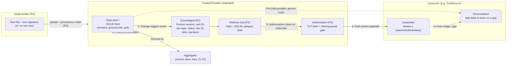

# CSAF 3.0 — Distribution & Discoverability Extensions

*[Diese Seite auf Deutsch lesen](README.de.md)* — the German version is a faithful, complete
translation of this document, not an independent text. In case of any discrepancy, this English
version is authoritative.

## Status of this folder

This is **not** a TC work product, but an individual discussion draft prepared ahead of the CSAF
Community Days (16–17 November 2026). The goal is an early, informal presentation of a possible
extension package for a future CSAF version — similar in spirit to the `csaf_2.0` sandbox folder,
just one version further out. Nothing here is normative, and nothing here binds the TC.

The underlying idea grew out of practical experience: as an operator of a CSAF Trusted Provider
(based on the BSI reference implementation) and as a party that needs to evaluate CSAF data from
multiple vendors on behalf of customers, a recurring structural problem in the current distribution
model becomes apparent — see Motivation below.

## Motivation

### The problem

CSAF documents are distributed exclusively via **pull** today (section 7.1, Requirements 11–17 of
the [CSAF 2.1 specification](../csaf_2.1/prose/share/csaf-v2.1-draft.md)). ROLIE feeds allow
categorization by product, but they do not provide a machine-readable summary (affected product
version, vulnerability ID, status) at the feed level. Anyone who wants to know whether a document is
relevant to them has to open it. For a vendor with a large, long-grown advisory corpus, that means:
download the entire corpus to find the one relevant handful of documents.

### Reality check against a concrete vendor

Red Hat publishes a dedicated CSAF/VEX document for practically every CVE associated with its
portfolio — a corpus in the order of an estimated 250,000 documents. A sample of the public advisory
directory
([`security.access.redhat.com/data/csaf/v2/advisories/2025/`](https://security.access.redhat.com/data/csaf/v2/advisories/2025/),
retrieved 2026-08-15) shows file sizes ranging from roughly 9 KB to 3.5 MB, typically 25–400 KB.

At 250,000 documents and a (conservatively assumed) average size of 50–150 KB, **a single consumer
who has to mirror the entire corpus once just to identify the documents relevant to them** faces a
transfer volume of roughly **12–36 GB** — for a single vendor, for a single product of interest.

### Scaling to the ecosystem

The real urgency comes from scale: with NIS2 and the Cyber Resilience Act, the circle of
organizations that must both produce and consume CSAF is set to grow substantially. Not every vendor
has a Red-Hat-sized corpus as a cautious, illustrative assumption for a "typical" vendor we use 200
documents (roughly the order of magnitude of a mid-sized PSIRT's corpus over several years), still at
50–150 KB per document:

| Vendors in the ecosystem | Total corpus (documents) | Transfer volume at 50 KB/doc | Transfer volume at 150 KB/doc |
| ---: | ---: | ---: | ---: |
| 5,000 | 1,000,000 | ≈ 48 GB | ≈ 143 GB |
| 50,000 | 10,000,000 | ≈ 477 GB | ≈ 1.4 TB |
| 100,000 | 20,000,000 | ≈ 954 GB | ≈ 2.9 TB |

**Important caveat:** this table shows the transfer volume for **one** consumer performing **one**
full mirror of the corpus. In practice this repeats on every poll cycle (daily/weekly) and - since
there is no shared, filtered distribution today - independently for **every** consumer. The real
number is a multiple of the table, not its ceiling. We deliberately present the conservative baseline
with an explicit methodology rather than a more impressive but less defensible aggregate figure.

### Sustainability as an additional, external driver

Data transfer has an energy cost. Published estimates of the energy intensity of internet data
transmission vary considerably by methodology (the literature spans several orders of magnitude); two
commonly cited, more recent reference points for fixed-line transmission are **0.03–0.14 kWh/GB**
(among others: Aslan et al.; the 2020 EU ICT impact study). Applied to the 50,000-vendor row (477 GB
– 1.4 TB), that is roughly **14–200 kWh** for a single full sync run by a single consumer — an order
of magnitude that adds up quickly across repeated cycles and many consumers.

> We recommend treating this figure in the presentation explicitly as an **order-of-magnitude
> argument, not a robust metric**, and stating the methodological uncertainty openly. Its purpose is
> to add a second, TC-external driver (sustainability discussion, EU Green Deal relevance) alongside
> the primary efficiency argument — not to be defended as hard proof.

### Why now

The problem has existed since CSAF 2.0. It becomes pressing only now because regulation-driven
adoption (NIS2, CRA) is expected to push a very large number of organizations into running this
inefficient pull-everything mechanism simultaneously and repeatedly. That justifies addressing the
topic early, rather than reacting once it has already become a scaling problem.

## Architecture sketch

Core message of the sketch: **nothing existing is replaced.** The data store / ROLIE feed remains the
authoritative, statically mirrorable source of truth (this is the answer to the resilience/
statefulness question, see counter-arguments below). Hub, authorization, and event schema are
additive building blocks on top; a provider who does not implement them loses nothing of what works
today.

## The four proposals

Each proposal is independently assessable and implementable; they build on one another but are not
all strictly required for one another (see dependencies per proposal). Details in the individual
documents under [`proposals/`](proposals/).

### [P1 — Event/digest schema](proposals/01-event-schema.md)

A compact, machine-readable summary object per document change: product version, vulnerability ID
(CVE/GHSA/gCVE/…), document type, status, document ID, date, signature.

- **Pros:** transport-independent — works for both pull and push; low implementation cost; directly
  solves the core problem ("do I have to open the document to check relevance"); could even be
  integrated into existing ROLIE entries or `changes.csv` independently of P2–P4.
- **Cons:** introduces a second, separately maintained "summary of truth" alongside the actual
  document — drift risk if event and document diverge; needs clear precedence rules (the document
  always remains authoritative); every document change creates extra maintenance for the provider.
- **Conclusion:** low risk, high value, independently implementable. Recommendation: implement as the
  first building block, regardless of whether push (P2) ever materializes.

### [P2 — Push transport (WebSub extension)](proposals/02-push-transport.md)

Optional push capability for Trusted Providers, built on the existing ROLIE feed as a WebSub topic
(W3C Recommendation since 2018).

- **Pros:** no new protocol needed — a mature, open standard with precedent at other SDOs (among
  others, the OGC SensorThings API extension in 2025 for IoT/sensor data); topic granularity ("one
  channel per product") already exists conceptually via ROLIE categories; purely additive, no
  replacement for pull.
- **Cons:** the first ever stateful server component in a spec that has deliberately been designed as
  stateless/static; real operational overhead for smaller providers; documented real-world weaknesses
  of WebSub (best-effort delivery, no built-in failover, a real spam incident in September 2025 on
  openly run hubs); vanilla WebSub has no access control whatsoever — for AMBER/RED strictly
  dependent on P3.
- **Conclusion:** worthwhile, but must be explicitly specified as optional/additive with mandatory
  reconciliation fallback to pull (see architecture sketch) — never as a replacement.

### [P3 — Channel authorization (TLP/sharing-group gate)](proposals/03-channel-authorization.md)

Authorization rule for push channels: delivery only to subscribers whose clearance matches the
document's TLP label or sharing group. Uses only fields that already exist
(`distribution.tlp.label`, `distribution.sharing_group.id`).

- **Pros:** requires almost no new schema; closes a gap the spec itself already acknowledges (access
  control is currently explicitly "up to the provider"); formalizes processes that are already
  practiced but currently undocumented (staged embargo release, KRITIS supply relationships).
- **Cons:** the spec must define authorization *semantics* for the first time, even though the
  concrete auth protocol is deliberately left open — genuinely new territory, and likely the most
  politically friction-heavy of the four proposals; risk of overlap with providers' own existing
  access systems.
- **Conclusion:** a necessary complement to P2, but should be scoped narrowly: mandate only *who* may
  see *what*, deliberately leave *how* authentication happens out of scope (analogous to how the spec
  mandates TLS today without prescribing a specific certificate).

### [P4 — Delegated publication (proxy Trusted Provider + provenance chain)](proposals/04-delegated-publication.md)

A formalized path for vendors without their own hosting/signature infrastructure to publish through
a Trusted Provider — including a cryptographic proof chain that the publication is authorized by the
original vendor.

- **Pros:** solves a real, observed inclusion problem (small/KRITIS-relevant vendors without their
  own infrastructure); builds almost entirely on what already exists: the "CSAF Proxy Provider"
  concept (currently only internal, aggregator-side), the existing signature requirements
  (Requirements 19/20), the existing identity anchor `publisher.namespace`, and the existing opt-in
  precedent (`list_on_CSAF_aggregators`/`mirror_on_CSAF_aggregators`).
- **Cons:** the delegation record itself (who authorized whom, for how long, revocation) is genuinely
  new, with governance weight comparable to RVISC; in the fallback without a vendor-owned key,
  non-repudiation is weaker — precisely where the proposal would be needed most; a new attack vector
  if someone falsely claims to be a delegate.
- **Conclusion:** the highest impact on inclusion/adoption of the four proposals, but also the one
  with the most new governance overhead. Should follow the already-successful RVISC governance
  pattern rather than inventing a new process.

## Counter-arguments & rebuttals

Objections to expect from the TC, with a factual response — deliberately anticipated so the proposal
does not come across as a naive sweeping change.

| Objection | Rebuttal |
| --- | --- |
| "CSAF is deliberately designed as stateless/static so distribution stays robust even when infrastructure breaks — this breaks that principle." | No such break: the store/ROLIE feed remains the authoritative, still-mirrorable source of truth. Push is purely additive, with mandatory pull-based reconciliation as a fallback (see architecture sketch). A provider who does not implement P2–P4 loses nothing. |
| "The TC is currently fighting to finish CSAF 2.1 — this is the wrong time." | Explicitly positioned as v3 material, no competition for 2.1 editor bandwidth. The goal of this presentation is early socialization of the idea, not inclusion in the current version. Four independently assessable small steps rather than one big change. |
| "The extension mechanism (Issue #1375) is still unresolved — don't open more architectural fronts now." | Fair point, but a different layer: #1375 is about schema extensibility of individual documents (section 2.4), these proposals concern the distribution layer (section 7). Largely orthogonal; once the extension mechanism is settled, P1 could even be expressed as an extension itself. |
| "This is just building infrastructure that TrustSource & co. will then sell as a product — is that really neutral?" | Hub/broker are deliberately specified as an open, protocol-based standard (WebSub), not a proprietary system — anyone can operate a hub, just as anyone can operate an aggregator today. No vendor lock-in intended. |
| "WebSub is blog/RSS technology, not enterprise/security grade." | A finished W3C standard since 2018, not an experiment. Current precedent: the OGC put forward a WebSub extension for the IoT-adjacent SensorThings API in 2025. Known weaknesses (best-effort delivery, no failover) are exactly why P2 is mandatorily paired with P1-based reconciliation, instead of relying on push alone. |
| "Small vendors already struggle with today's Trusted Provider requirements — this raises the bar further." | P4 lowers the bar for small vendors rather than raising it: their effort shrinks to "upload a file somewhere"; the operational overhead of hub/authorization sits with the (typically larger) Trusted Provider offering the broker service, not with the originating vendor. |
| "Access control is not the job of a data format standard." | The biggest friction point, not downplayed. Recommendation: scope P3 narrowly — mandate only *that* an authorization decision must be based on `tlp`/`sharing_group`, not *how* authentication is implemented. Same pattern already used for TLS today (mandated, specific certificate choice left open). |

## Open items / do not forget

- **Client-side signature tests.** P4 (and, to a lesser extent, P1/P2) needs new entries in the test
  catalog (section 6 of the specification, analogous to today's 61 mandatory / 54 recommended / 22
  informative tests): verification of the vendor signature, verification of the Trusted Provider
  counter-signature, verification of the delegation record's validity/non-expiry, consistency check
  between event payload and actual document content. **Do not forget this before turning this into
  concrete spec text.**
- **Retention window for reconciliation.** The ROLIE feed and `changes.csv` currently have no
  guaranteed minimum retention period — needed for P1-based reconciliation after a longer hub outage.
- **Access protection of the reconciliation source.** The `changes.csv`/feed for an AMBER tier must
  carry the same authorization protection as the corresponding push channel — otherwise P3 can be
  bypassed via the pull fallback.
- **Revocation semantics for delegation records (P4).** Expiry/revocation mechanism, analogous to the
  existing signature validity logic (Requirement 19), still to be specified.

## Next steps

1. Flesh out the four proposal documents under `proposals/` with concrete spec text.
2. Use this overview as the basis for the presentation at CSAF Community Days 2026.
3. After informal feedback: decide whether and in what order issues/PRs are brought into the TC
   repository.
